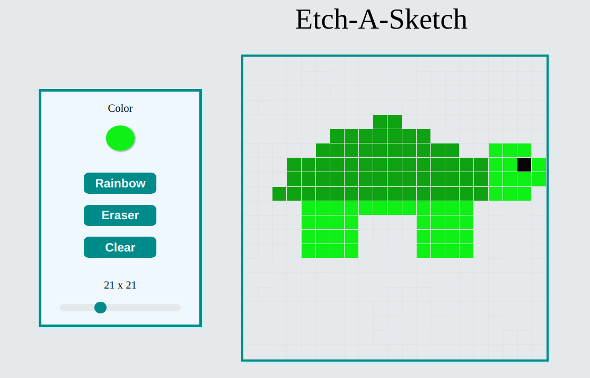

# etch-a-sketch

Etch-a-sketch game created using HTML, CSS, JS, my first larger project using JS.
Made for the Odin Project.

Allows the user to create their own pixel art.

Includes: 

- An eraser brush
- Option to choose a color from the webpage
- A rainbow brush
- An erase function
- Multiple choices of grid size, from 1x1 to 64x64

[Live app] {https://camronrule.github.io/etch-a-sketch/}